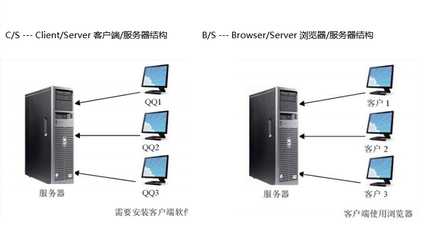
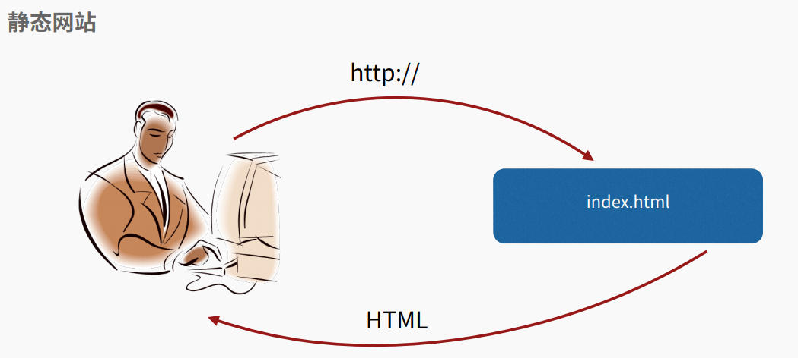

Web开发介绍
===

---

## 一、认识一个网站

> 最早的软件都是运行在大型机上的，软件使用者通过“哑终端”登陆到大型机上去运行软件。
> 
> 后来随着PC机的兴起，软件开始主要运行在桌面上，而数据库这样的软件运行在服务器端，这种Client/Server模式简称CS架构。
> 
> 随着互联网的兴起，人们发现，CS架构不适合Web，最大的原因是Web应用程序的修改和升级非常迅速，而CS架构需要每个客户端逐个升级桌面App，因此，Browser/Server模式开始流行，简称BS架构。
>
> 在BS架构下，客户端只需要浏览器，应用程序的逻辑和数据都存储在服务器端。浏览器只需要请求服务器，获取Web页面，并把Web页面展示给用户即可。
>
> 当然，Web页面也具有极强的交互性。由于Web页面是用HTML编写的，而HTML具备超强的表现力，并且，服务器端升级后，客户端无需任何部署就可以使用到新的版本，因此，BS架构迅速流行起来

### B/S和C/S结构

> B/S结构的优势
> 
> 不需要通知客户端安装某个软件 -- 只需要客户端有浏览器
> 
> 不需要通知客户端进行软件升级 -- 只需要升级服务器
> 
> 可以轻松的实现跨平台 --

### web1.0
> 
> Web 1.0时代开始于1994年，其主要特征是大量使用静态的 HTML 网页来发布信息，并开始使用浏览器来获取信息，这个时候主要是单向的信息传递。通过Web万维网，互联网上的资源，可以在一个网页里比较直观地表示出来，而且资源之间，在网页上可以任意链接。Web1.0的本质是聚合、联合、搜索，其聚合的对象是巨量、无序的网络信息。Web1.0 只解决了人对信息搜索、聚合的需求，而没有解决人与人之间沟通、互动和参与的需求，所以Web2.0应运而生
> 
> 就是个静态网站,只能看不能写,没有交互

### web2.0

> Web 2.0 始于 2004 年 3 月 O’Reilly Media 公司和 MediaLive 国际公司的一次头脑风暴会议。Tim O’Reilly 在发表的“What Is Web2.0”一文中概括了Web2.0的概念，并给出了描述 Web2.0 的框图——Web2.0 MemeMap，该文成为 Web2.0 研究的经典文章。此后关于 Web2.0 的相关研究与应用迅速发展，Web2.0 的理念与相关技术日益成熟和发展，推动了Internet的变革与应用的创新。在Web2.0中，软件被当成一种服务，Internet从一系列网站演化成一个成熟的为最终用户提供网络应用的服务平台，强调用户的参与、在线的网络协作、数据储存的网络化、社会关系网络、RSS应用以及文件的共享等成为了Web2.0发展的主要支撑和表现。Web2.0模式大大激发了创造和创新的积极性，使Internet重新变得生机勃勃。Web 2.0的典型应用包括Blog、Wiki、RSS、Tag、SNS、P2P、IM等
> 
> 就是动态网站,最直接的体现就是我们现在使用的商城,论坛,微博等,

---

## 二、Web应用结构 及 工作原理

---

## 三、Web框架

* ### 一、什么是框架?

    > 软件框架就是为实现或完成某种软件开发时,提供了一些基础的软件产品,
    >
    > 框架的功能类似于基础设施,提供并实现最为基础的软件架构和体系
    >
    > 通常情况下我们依据框架来实现更为复杂的业务程序开发
    >
    > 一个字,框架就是程序的骨架
    

* ### 二、框架的优缺点

    > 可重用
    >
    > 成熟,稳健
    >
    > 可扩展性良好
    >
    > 选对框架很重要
    

* ### 三、python中常见的框架

    > 大包大揽 Django 被官方称之为完美主义者的Web框架。
    >
    > 力求精简 web.py和Tornado
    >
    > 新生代微框架 Flask和Bottle

* ### 四、web框架中的一些概念

    * ### MVC

        * 大部分开发语言中都有MVC框架
        * MVC框架的核心思想是：解耦
        * 降低各功能模块之间的耦合性，方便变更，更容易重构代码，最大程度上实现代码的重用
        * m表示model，主要用于对数据库层的封装
        * v表示view，用于向用户展示结果
        * c表示controller，是核心，用于处理请求、获取数据、返回结果

    * ### MVT

        * Django是一款python的web开发框架
        * 与MVC有所不同，属于MVT框架
        * m表示model，负责与数据库交互
        * v表示view，是核心，负责接收请求、获取数据、返回结果
        * t表示template，负责呈现内容到浏览器