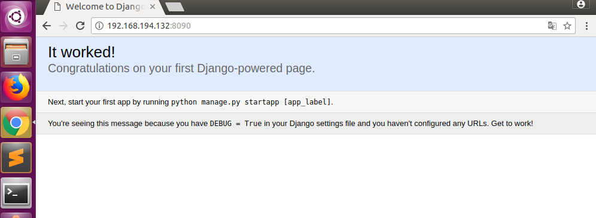

Django入门
===

---

## 一、Django框架的搭建


```js
django安装后 进行django框架的搭建

django-admin startproject mysite

mysite是项目目录名，可以自定义，
```

> 我们来看看startproject创建的内容：

```js
tree是linux命令负责将当前文件夹以数状结构显示,
如若提示未找到命令进行 sudo apt-get install tree 即可

yc@yc-virtual-machine:~/test$ tree
.
└── mysite
    ├── manage.py
    └── mysite
        ├── __init__.py
        ├── settings.py
        ├── urls.py
        └── wsgi.py

2 directories, 5 files
```

关于上面自动生成的目录与文件解释如下

> 外部test/根目录只是一个项目的容器。它的名字与Django无关; 您可以将其重命名为您喜欢的任何内容。
> manage.py：一个命令行实用程序，可以让您以各种方式与此Django项目进行交互。你可以阅读所有的细节 manage.py在Django的管理和manage.py。
> 内部mysite/目录是您的项目的实际Python包。它的名字是您需要用来导入其中的任何内容的Python包名称（例如mysite.urls）。
> mysite/init.py：一个空的文件，告诉Python这个目录应该被认为是一个Python包。
> mysite/settings.py：此Django项目的设置/配置。 Django设置会告诉你所有关于设置的工作原理。
> mysite/urls.py：该Django项目的URL声明; 您的Django动力网站的“目录”。
> mysite/wsgi.py：WSGI兼容的Web服务器为您的项目提供服务的入口点。

---

## 二、启动项目

在当前 manage.py的文件目录下 执行一下命令

```bash
sudo python3 manage.py runserver
```

您将在命令行中看到以下输出：

```sql
Performing system checks...

System check identified no issues (0 silenced).

You have unapplied migrations; your app may not work properly until they are applied.
Run 'python manage.py migrate' to apply them.（注意：现在忽略关于未执行应用数据库迁移的警告）

August 07, 2017 - 15:50:53
Django version 1.11, using settings 'mysite.settings'
Starting development server at http://127.0.0.1:8000/
Quit the server with CONTROL-C.
```

注意：通过IP访问后报如下错误：

```sql
DisallowedHost at /polls
Invalid HTTP_HOST header: '192.168.*.*:8000'. You may need to add '192.168.*.*' to ALLOWED_HOSTS.

HTTP_HOST标头无效：'192.168.*.*:8000'。您可能需要将“192.168.*.*”添加到ALLOWED_HOSTS
解决：
进入 mysite/settings.py文件
ALLOWED_HOSTS = ['192.168.194.132']
```

---

## 三、浏览器访问

