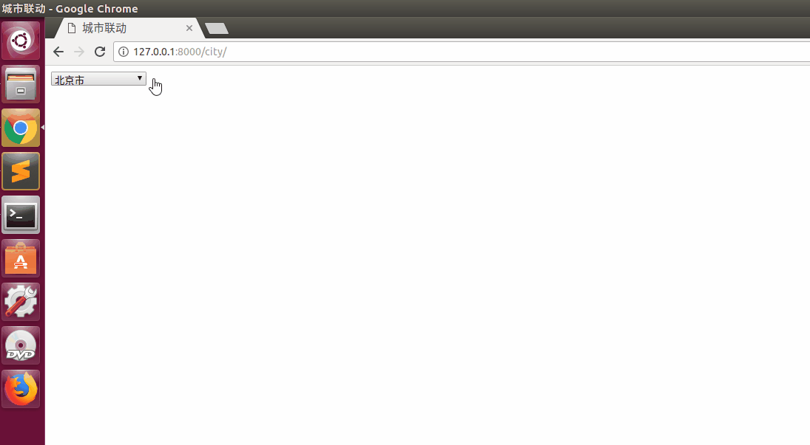

Ajax实例
===

---

**使用jquery中的ajax实现省市区的多级联动的选择**

**最终实现效果如下图:**



# 城市联动

* ### 在数据库中导入 数据

    ```python
    ...
    ```

* ### 创建模型

    ```python
    from django.db import models

    # Create your models here.

    class district(models.Model):
        name = models.CharField(max_length=255)
        upid = models.IntegerField()
        class Meta:
            db_table = "district"  # 指定表名
    ```

* ### 定义路由

    ```python
    from django.conf.urls import url
    from . import views

    urlpatterns = [

        # ajax 城市联动
        url(r'^city/$', views.city,name="city"),
        url(r'^city/([0-9]+)$', views.city2,name="city2"),
    ]
    ```

* ### 定义模板

    ```html
    <!DOCTYPE html>
    <html>
    <head>
        <meta charset="utf-8">
        <title>城市联动</title>
    </head>
    <body>

        <select id="citys">
            <option>--请选择省--</option>
        </select>

        <script type="text/javascript" src="/static/js/jquery-1.8.3.min.js"></script>
    </body>
    </html>
    ```